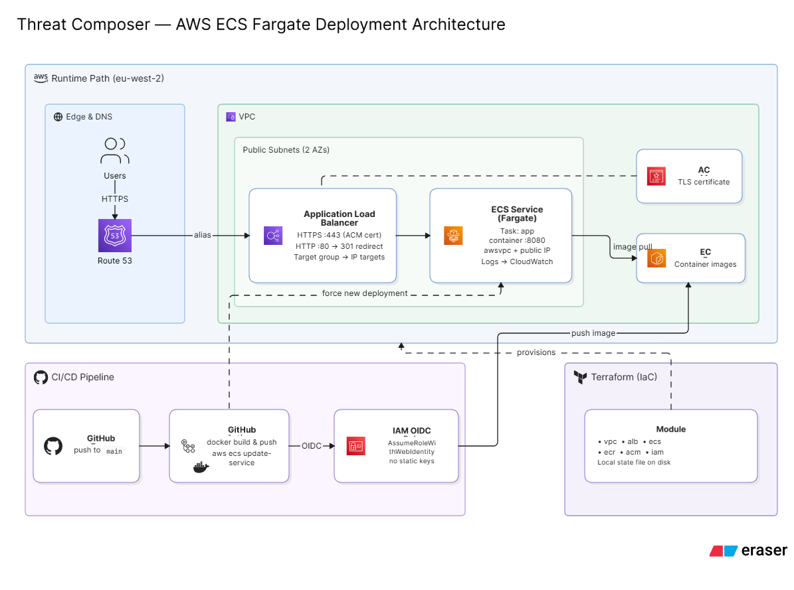
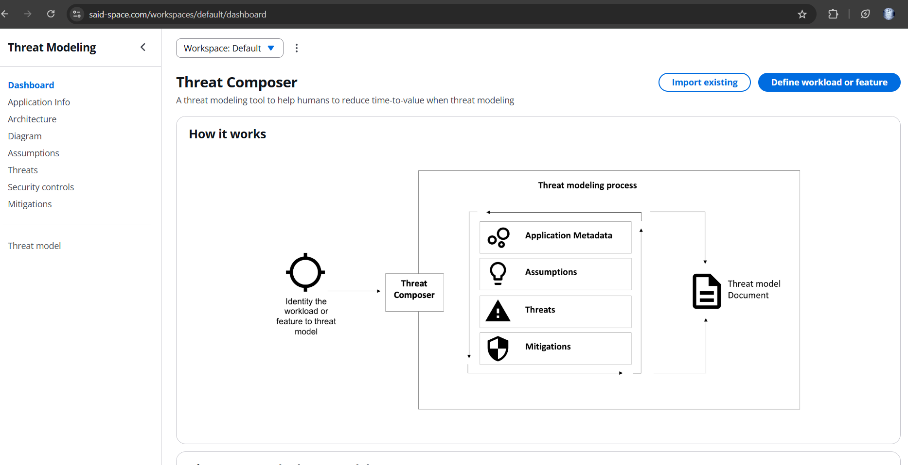

# Threat Composer on AWS ECS Fargate

A containerised deployment of [Threat Composer](https://github.com/awslabs/threat-composer) (Amazon's open-source threat modelling tool) to AWS, built to mirror a real production workload: Docker, ECS Fargate, an Application Load Balancer, Terraform-managed infrastructure, GitHub Actions CI/CD with OIDC (no static AWS keys), and HTTPS on a custom domain via ACM and Route 53.

**Live at:** [https://said-space.com](https://said-space.com)

## Architecture

## Directory structure

    .
    ├── app/                    # Threat Composer application source
    ├── Dockerfile
    ├── .dockerignore
    ├── infra/                  # Terraform (modular structure)
    │   ├── main.tf
    │   ├── variables.tf
    │   ├── outputs.tf
    │   ├── provider.tf
    │   ├── terraform.tfvars
    │   └── modules/
    │       ├── vpc/
    │       ├── ecr/
    │       ├── alb/
    │       ├── ecs/
    │       ├── iam/
    │       └── acm/
    ├── .github/
    │   └── workflows/
    │       └── deploy.yml      # Build → push to ECR → force ECS deployment
    ├── images/                 # README screenshots and diagram
    └── README.md

## Screenshots

The app running live, served over HTTPS via ACM and Route 53:

## Reproducing this setup

Prerequisites: an AWS account, a registered domain in Route 53 (registration creates a hosted zone automatically), Terraform, Docker, and the AWS CLI configured.

1. Clone the repo and build the app image locally to confirm it runs:

       docker build -t threat-composer .
       docker run -p 8080:8080 threat-composer

2. Push the image to an ECR repository (create one first, or let the `ecr` module manage it):

       aws ecr get-login-password --region eu-west-2 | docker login --username AWS --password-stdin <account-id>.dkr.ecr.eu-west-2.amazonaws.com
       docker push <account-id>.dkr.ecr.eu-west-2.amazonaws.com/threat-composer:latest

3. Set your domain in `infra/terraform.tfvars`:

       domain_name = "your-domain.com"

4. Initialise and apply the Terraform stack:

       cd infra
       terraform init
       terraform plan
       terraform apply

5. Wait for ACM to validate the certificate via DNS (usually under a few minutes) — `terraform apply` will pause here automatically until it's issued.

6. Visit `https://<your-domain>` to confirm the app is live over HTTPS.

7. For CI/CD: add the GitHub Actions OIDC role ARN (output as `github_actions_role_arn`) to your repo, and pushes to `main` will build, push to ECR, and force a new ECS deployment automatically.

To tear everything down and stop AWS costs:

       cd infra
       terraform destroy

## Notes

**Why CI/CD doesn't run Terraform.** The pipeline is deliberately scoped to build → push to ECR → force a new ECS deployment, and never runs `terraform apply`. This avoids a real risk: with local Terraform state, a CI run and a manual `apply` could race and corrupt the state file. Infrastructure changes are applied manually and reviewed with `terraform plan` first.

**Debugging GitHub's immutable `sub` claim change.** After building the OIDC trust policy, every pipeline run failed at `configure-aws-credentials` with `Not authorized to perform sts:AssumeRoleWithWebIdentity`. Ruled out in order: an incorrect trust policy structure, a wrong OIDC audience, missing workflow permissions, and an outdated action version — all confirmed correct. The actual cause was a GitHub platform change (effective 15 July 2026): repositories created after that date append immutable numeric owner/repo IDs to the OIDC `sub` claim, breaking trust policies pinned to the legacy name-only format. Fixed by updating the trust policy's `StringLike` condition to include the numeric IDs, pulled via the GitHub API. A useful side-lesson: `AssumeRoleWithWebIdentity` is a global STS event logged in `us-east-1`, not the working region — CloudTrail in the deployment region won't show it.

**State management.** This project uses local Terraform state, which is fine for a single-operator project like this one but has no locking — a natural next step for a team setting would be an S3 backend with a DynamoDB lock table.
